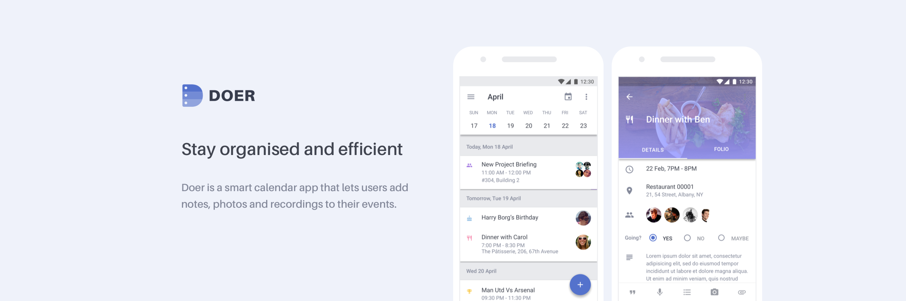

          

                
Concept

          

          

                
As a Business Development professional, I would often come back from meetings or conferences with meeting minutes in my notes app, photos and videos in my gallery and business cards in my pocket. I found that no app tied the information, memories or inspiration to the event itself. This also applied to any other social events I would attend.

				
				
And so, after performing some preliminary market research, we set out to build the first app that would do just that - bring together your notes, photos and other data files directly into your calendar app. Thus Doer was born.

> What happens at your events, stays with your events.

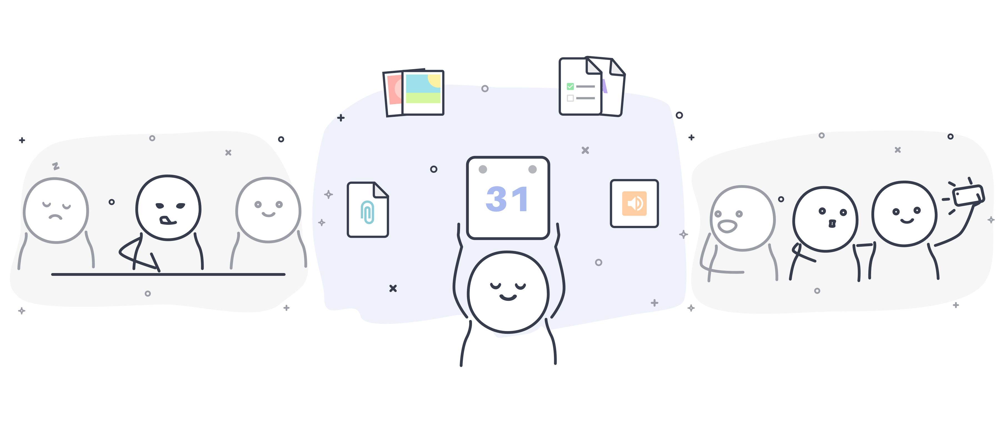
          

          

                
Research

          

          

          		
We dug deep into our professional networks and spoke to a lot of professionals across industries. The need, for a product that solved this issue, was ubiquitous and unanimous. However, we understood two critical aspects that would have to be accounted for.

Smart Agenda

Users wanted a more efficient experience from their main Agenda view. So we created shortcuts called Quick Actions that would let users contact attendees directly, and Smart Icons that would be auto-assigned based on keywords in event titles.

Quick Notes

For unplanned events, we created a process that would allow users to write notes, record audio and add photos first, and then assign an event title once done. The location and timestamps would be auto-filled to make the user-experience smoother. 

          

          

                

          

          

          
Information Architecture

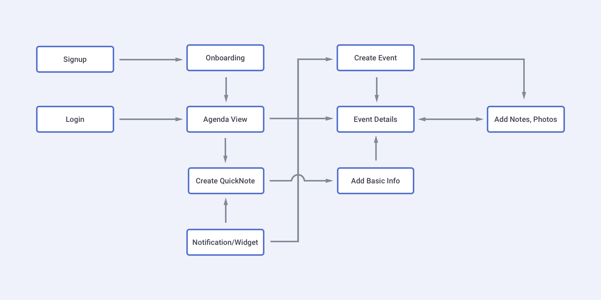

          

                
Branding

          

Palette

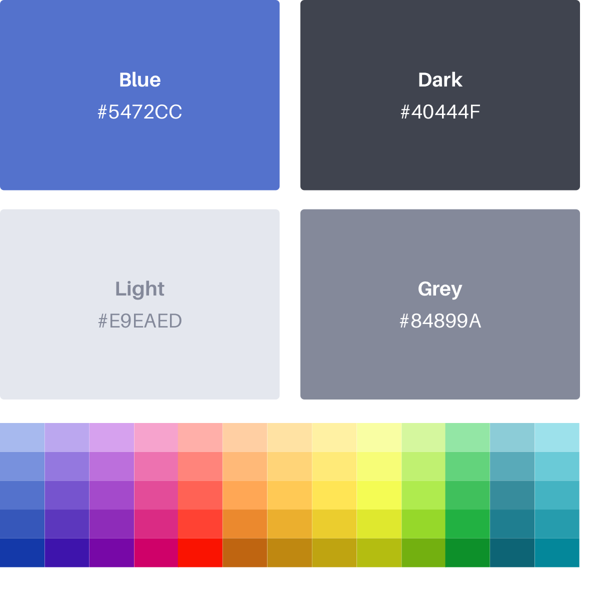

Logo / Icon

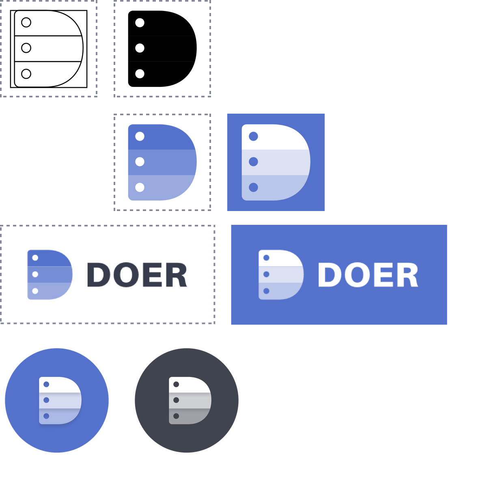

Typography

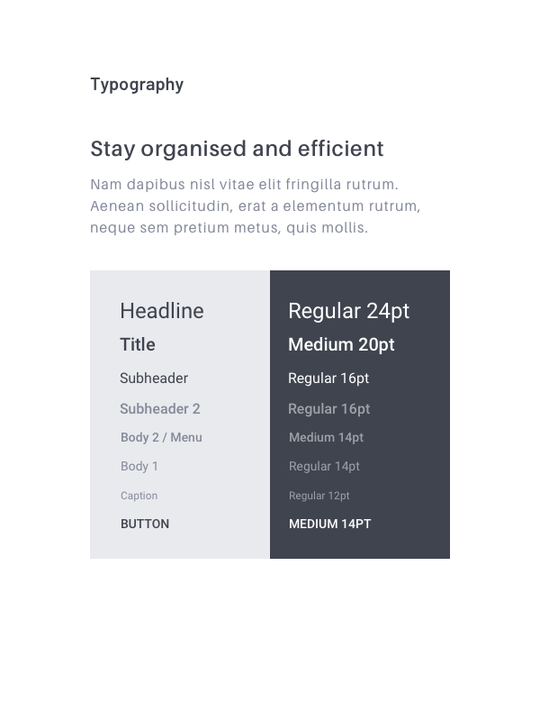

          

                
Illustrations

          

The animated versions of these SVGs can be viewed on the <a href="https://www.getdoer.com" target="_blank">website</a>.

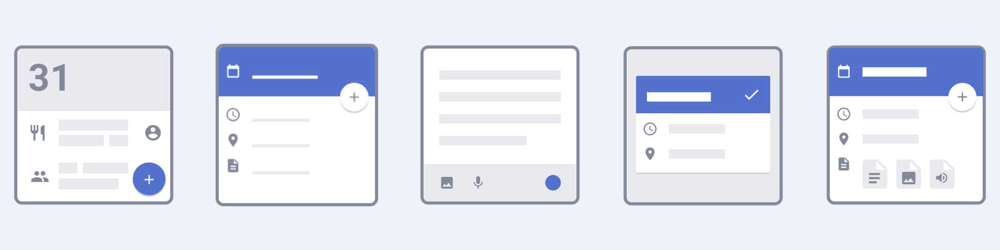

          

                
Mockups

          

List View

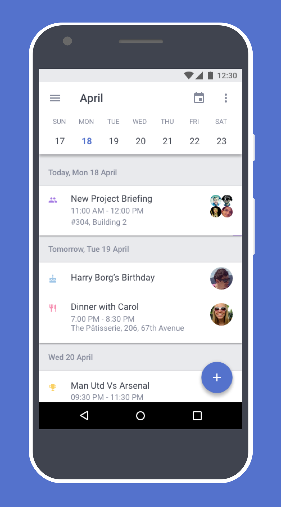

Create Event

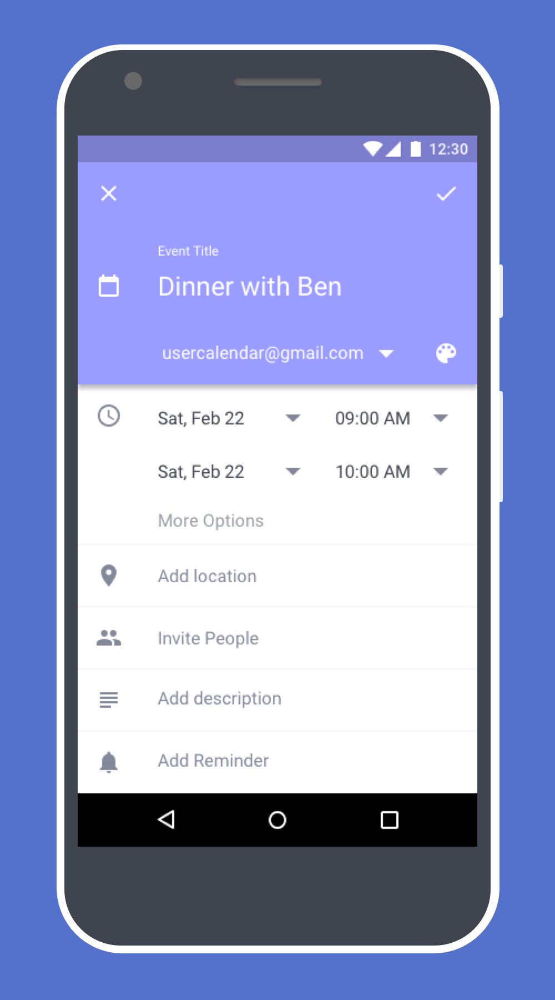

Details

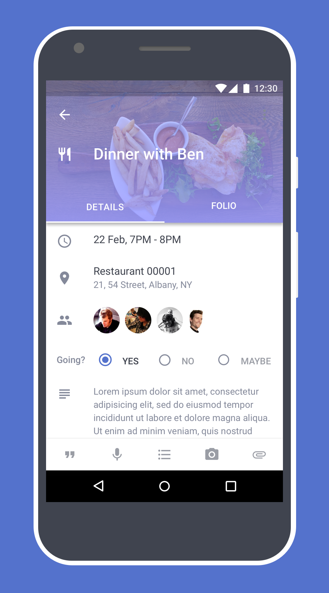

Folio

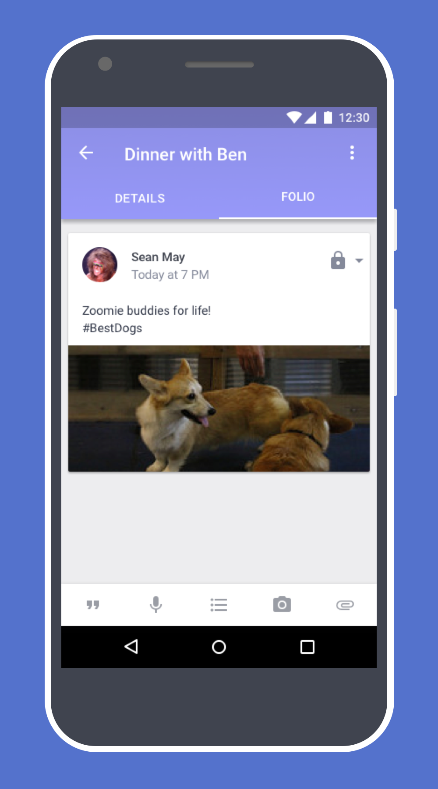

Notes

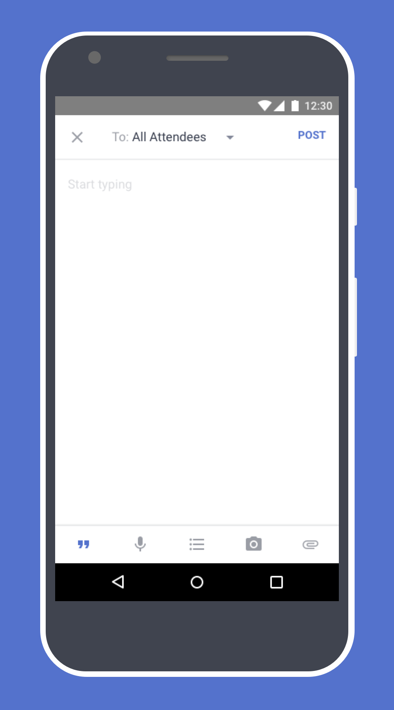

Camera

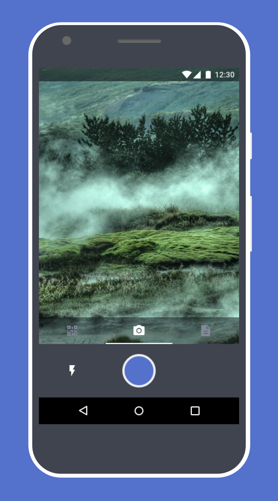

Notes Data

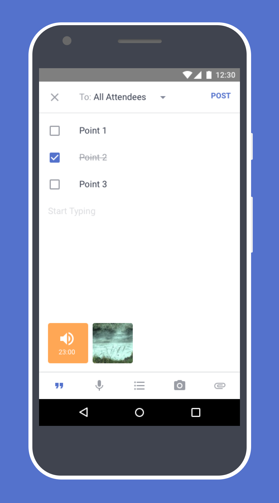

Files

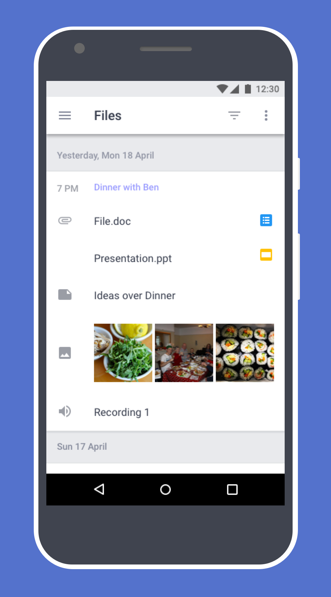

Date Picker

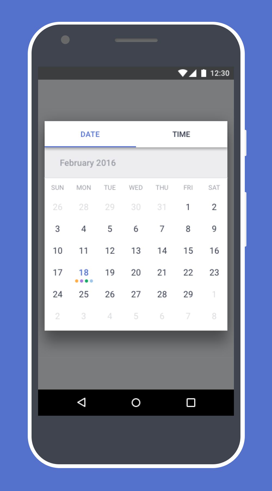

Widget

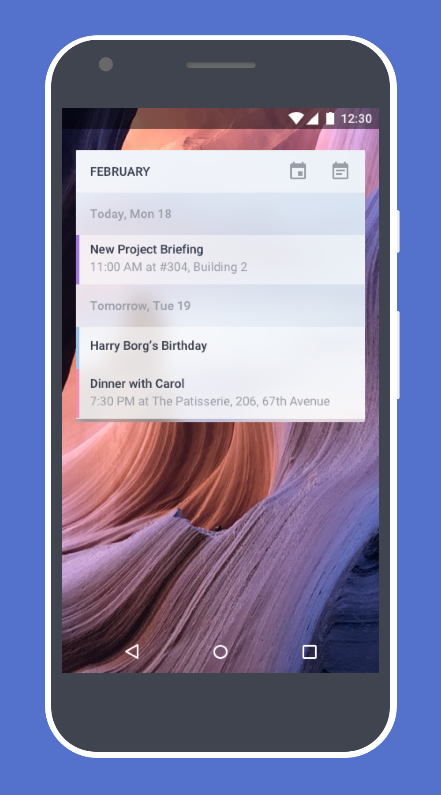

          

            

          

Responsive Material Design HTML4 Event Invitation - <a href="https://www.dropbox.com/s/auo7ubmrqi6gnh1/Doer%20Event%20Mail.html?dl=1" download>Download Link</a>

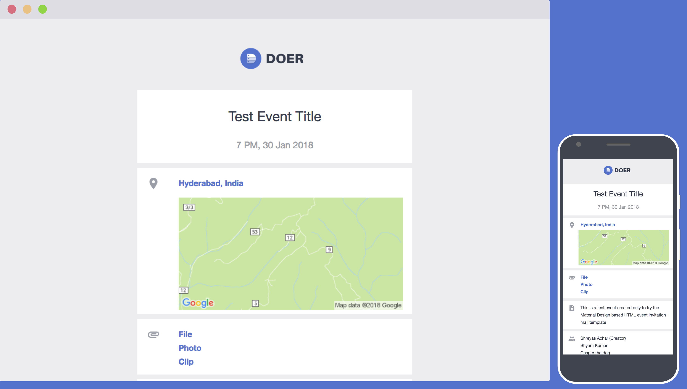

<b>Note:</b> The mockups contain placeholder data and the number of screens is not exhaustive

Doer is still in development. Interested users can sign up over at the <a href="https://www.getdoer.com" target="_blank">official website</a>

