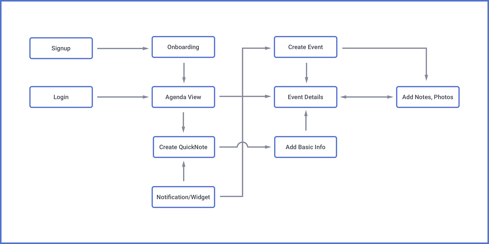

##Concept

As a Business Development professional, I would often come back from meetings or conferences with meeting minutes in my notes app, photos and videos in my gallery and business cards in my pocket. I found that no app tied the information, memories or inspiration to the event itself. And so, after performing some preliminary market research, we set out to build the first app that would do just that - bring together your notes, photos and other data files directly into your calendar app. Thus Doer was born.

> What happens at your events, stays with your events.

	

##Research

We dug deep into our professional networks and spoke to a lot of professionals across industries. The need, for a product that solved this issue, was ubiquitous and unanimous. However, we understood two critical aspects that would have to be accounted for.

Smart Agenda

Users wanted a more efficient experience from their main Agenda view. So we created shortcuts called Quick Actions that would let users contact attendees directly, and Smart Icons that would be auto-assigned based on keywords in event titles.

Quick Notes

For unplanned events, we created a process that would allow users to write notes, record audio and add photos first, and then assign an event title once done. The location and timestamps would be auto-filled to make the user-experience smoother. 

###Information Architecture

##Branding

The brand had to come across as professional, yet friendly and we made our choices accordingly. It was also a conscious decision to keep the interface minimal in design, considering other colorful elements would be fetched automatically in the form of calendar and event colors, attendee photos and smart icons from users' calendar events data.

##Interface

###Functional Illustrations

While illustrations and mockups were developed parallely, I created illustrations that explained the unique offering of the product without adding clutter to the interface. Some of the illustrations shown below can be seen as animated SVGs on the <a href="https://www.getdoer.com" target="_blank">website</a>. 

###Sketch Mockups

Next step was creating mockups - Although we started with Holo, we pivoted to <a href="https://www.material.io" target="_blank">Material Design</a> upon its initial release. I have always preferred creating mockups with Sketch directly. Without a great deal of knowledge about frameworks like Atomic Design, I made everything manually. After a ton of iterations, the screens ended up looking like this - 

<b>Note:</b> The mockups contain placeholder data and the number of screens is not exhaustive

Doer is still in development. Interested users can sign up over at the <a href="https://www.getdoer.com" target="_blank">official website</a>

