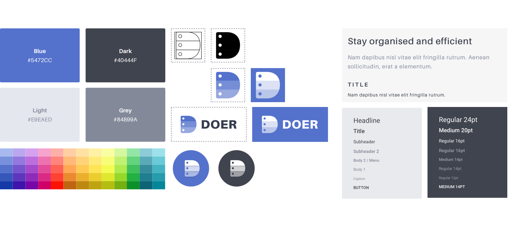

  

    

  
<a href="https://www.getdoer.com" rel="noopener" target="_blank">Doer</a> is a flagship product from <a href="https://doer.studio" rel="noopener" target="_blank">Doer Studio</a>. Doer is a smart calendar app that allows users to add notes, files, photos and audio recordings to their calendar events.

    

  
The idea for Doer came from the realization that none of the apps brought together data captured at events and the events themselves

  
We spoke to a lot of professionals across industries. The need, for a product that solved this issue, was ubiquitous and unanimous. We came up with unique features and created a Process Flow, in accordance.

  

<h3 class="f3">Branding Process</h3>

We came up with a clean, minimal and professional palette considering that the interface would also have colors fetched form users' calendars and photos

Next up was functional illustrations for the interface, onboarding and marketing. The animated versions of these SVGs can be viewed on the <a href="https://www.getdoer.com" rel="noopener" target="_blank">website</a>.

<h3 class="f3">Smarter Calendar</h3>

Everything you’d expect from a modern calendar app, plus some great features like Quick Actions, Smart Icons and Event Attachments

<h3 class="f3">Text Editor</h3>

Users can add multiple notes, photos and audio recordings before, during, or after their events, and view them right within the app.

<h3 class="f3 mt5">Doing it better</h3>

Doer also packs some additional useful features that enhance the user-experience

Date Picker & Homescreen Widget
  

 

Material Design Event Mail
  

  

Note — The mockups contain placeholder data and the number of screens is not exhaustive

Doer is still in development. Interested users can sign up over at the <a href="https://www.getdoer.com" rel="noopener" target="_blank">official website</a>

