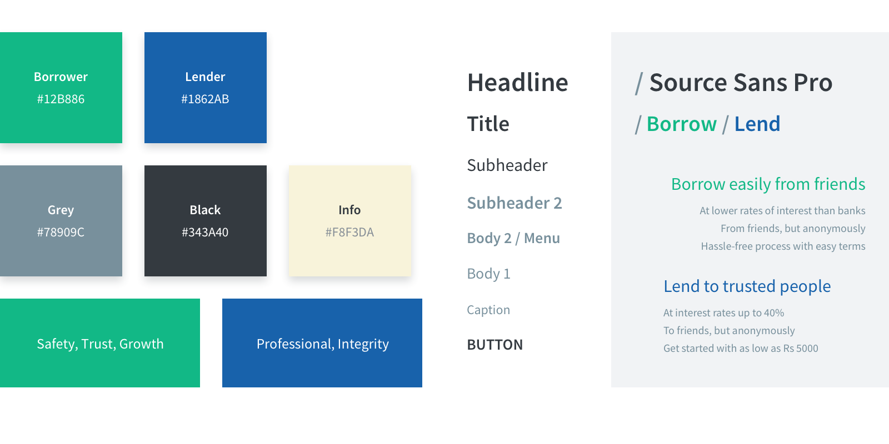
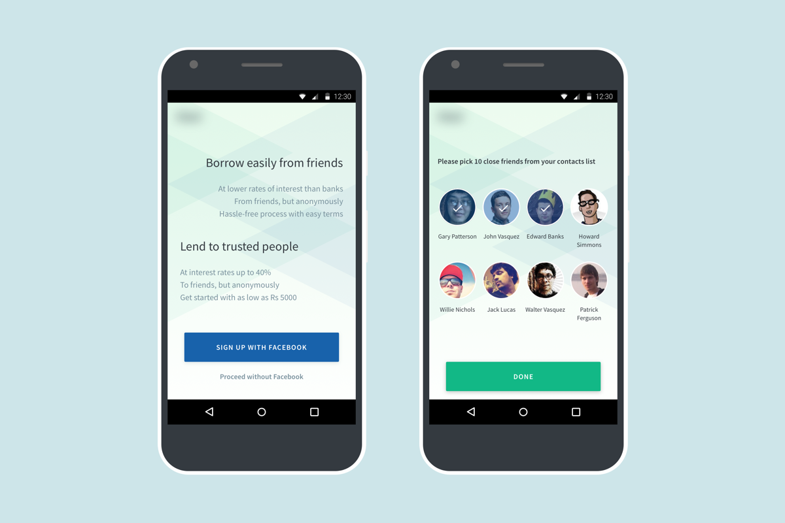
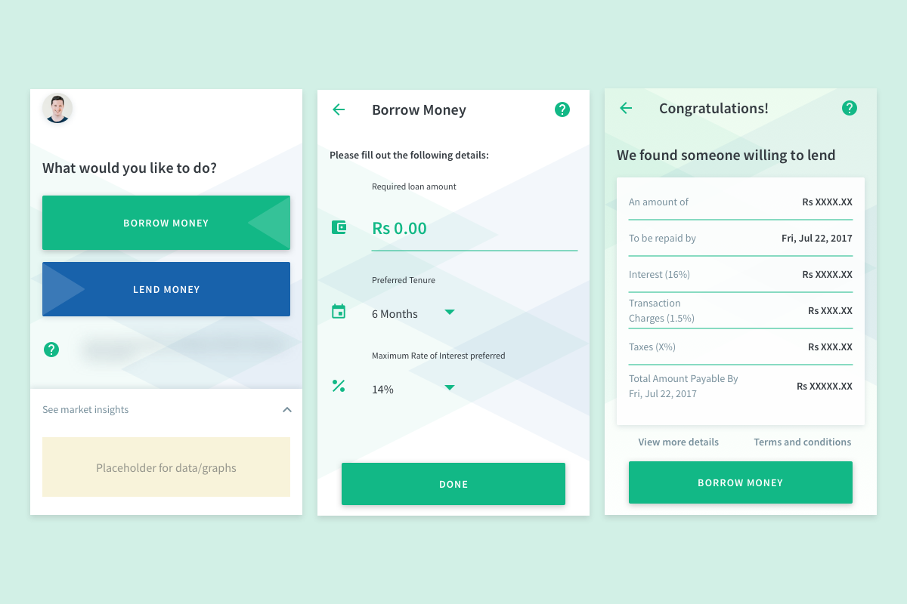
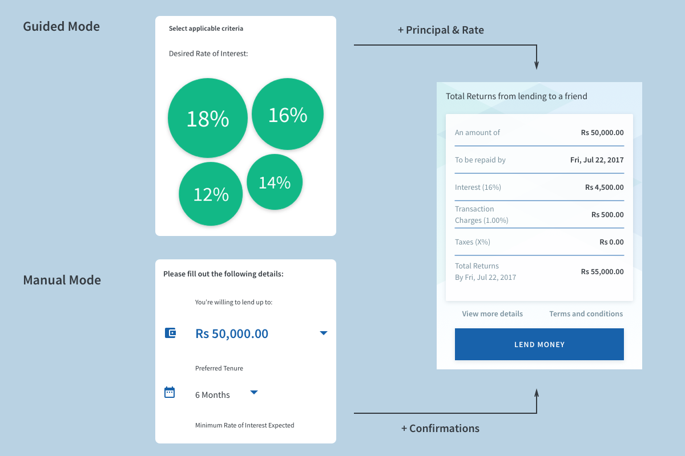

 Note — Key parts of this case are omitted or obfuscated to comply with a non-disclosure agreement.

  

    

  
A few industry veterans have been toying with the idea of a Peer-to-peer lending app for the Indian market. They aim to disrupt the notorious pay-day loans and the unofficial lending industries, prevalent there.

    

  
I was approached to design the product in totality and assist the development team in the rollout of the product. The app is also set to use the Unified Payments Interface framework, launched recently by the Govt of India.

We conducted some extensive surveys and workshops with teams and representatives of the target market, and ended up with usable wireframes

  

<h3 class="f3">Branding Process</h3>

As always, the design process started with creating a brand palette and setting the type

<h3 class="f3">Onboarding Experience</h3>

The onboarding experience is designed to build trust and take users through the registration process with ease

<h3 class="f3">Borrowing Journey</h3>

The borrowing journey ensures that the user is guided through the process with statistics, suggestions and warning.

<h3 class="f3">Lending Journey</h3>

The lending experience is designed to offer a guided journey as well as a manual journey, with the former showing most effective terms as primary choices

Note — The mockups contain placeholder data and the number of screens is not exhaustive

The app is being currently developed by a dedicated team in India, and should be ready for a closed beta roll-out later this year.

 

