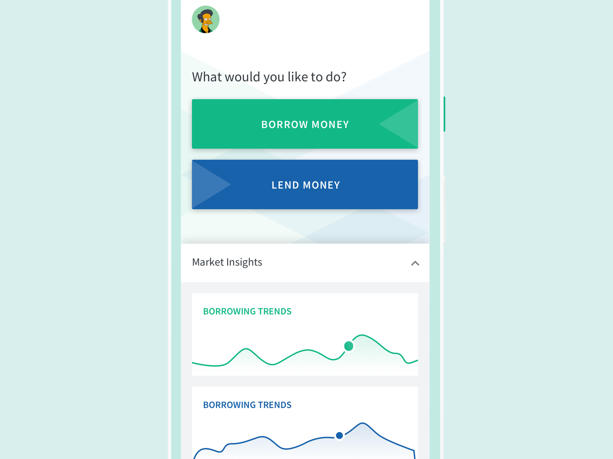

Note — Key parts of this case are omitted or obfuscated to comply with a non-disclosure agreement.

          

                
Concept

          

I was approached by a few senior investment and banking professionals with an idea of creating a peer-to-peer lending app for a specific demographic in India. They aim to disrupt the notorious pay-day loans and the unofficial lending industries, prevalent there. The app's ease of adoption and use is facilitated being through the usage of the Unified Payments Interface framework, launched recently by the Govt of India. 

          

                
Wireframes

          

The team came to me with some of their own back-of-the-napkin mockups, in addition to the concept note. It gave us a great starting point for the work ahead.

          

                
Iteration	

          

Best Viewed on Large Screen.   Mockups list not exhaustive. 

          

                
Branding

          

	

		

			
Palette

			
		

	
Typography

			
		

          

                
Mockups

          

While creating the mockups, we tried to create an Atomic Design system that would help maintain a modular structure which would in-turn make development of React or Angular based components easy. 

          

                
Onboarding

          

          

                
Borrowing Journey

          

          

                
Lending Journey

          

  
Manual Lending Journey

  
Guided Lending Journey

  
Confirmations

<b>Note:</b> The mockups contain placeholder data and the number of screens is not exhaustive

The app is being currently developed by a dedicated team in India, and should be ready for a closed beta roll-out later this year.

 

