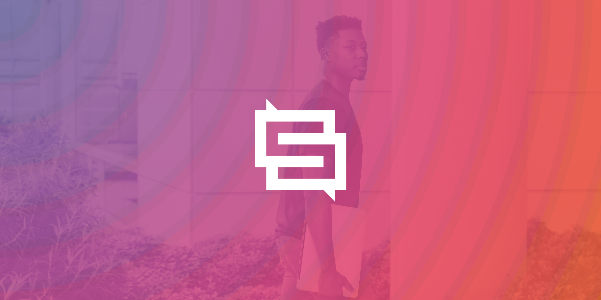
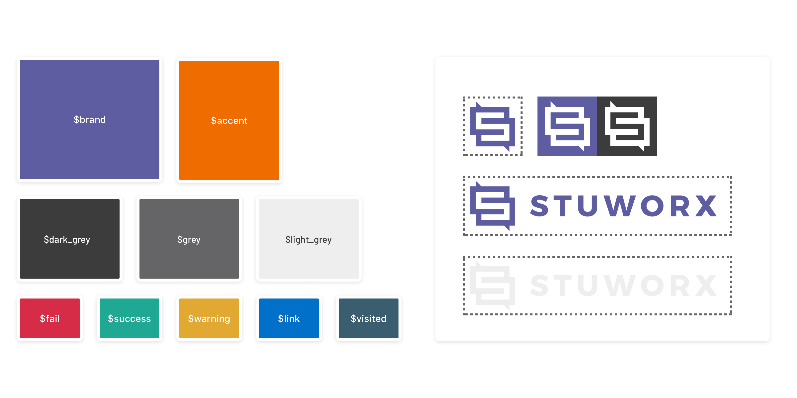
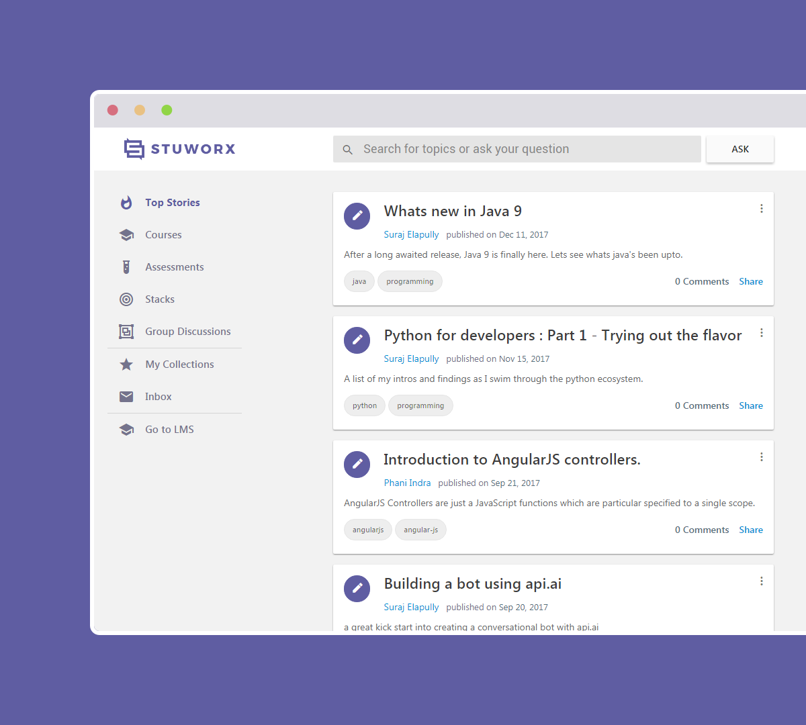
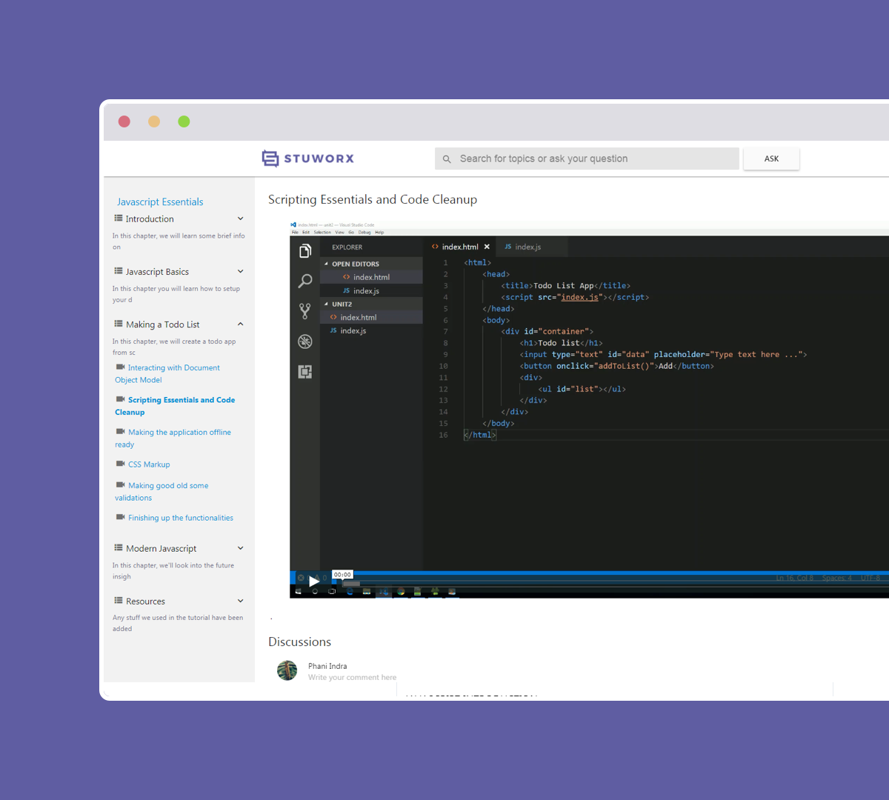
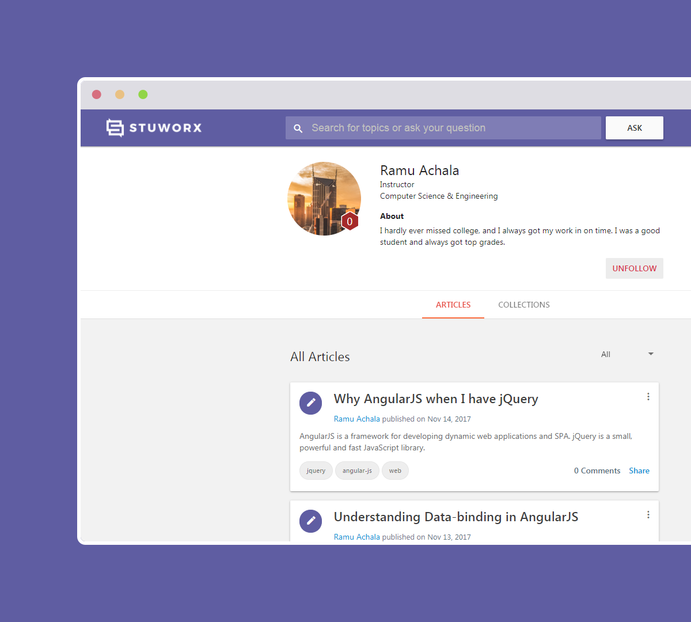
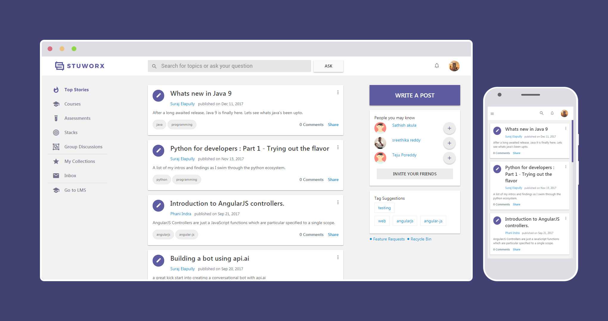

  

    

  
<a href="https://www.stuworx.com" rel="noopener" target="_blank">Stuworx</a> is a comprehensive learning & skill development platform focused on enhancing the employability of higher education students.

    

  
I was hired to help the extremely competent engineering team with the implementaiton of a scalable design system for web and mobile.

Since the team had already worked extensively on developing the product using <a href="https://material.angular.io/" rel="noopener" target="_blank">Angular Material</a>, I had to employ a more collaborative approach - 

 

01

Define product and growth goals with data-driven inferences

  

02

Review current design against defined requirements

03

Create rudimentary mockups to deliberate over functions

04

List development goals, action points and timelines
 

  

  

  

<h3 class="f3">Branding Process</h3>

We started the design process with a branding exercise that set a structure for the interface design going forward.

<h3 class="f3">Curated homepage</h3>

A curated feed with questions, posts and course related information on the homepage.

<h3 class="f3">Learning & Assessment</h3>

A comprehensive learning management and assessment module with Rich Media and Online IDE support 

<h3 class="f3">Student Profiles</h3>

Activity based profile for easy sharing with recruiters 

<h3 class="f3 mt5">Progressive Web App</h3>

Stuworx is built as a Progressive Web App and is hence reliable, fast and engaging, on desktop and mobile

  

Note — The mockups contain placeholder data and the number of screens is not exhaustive

Stuworx is currently is being used by students from 2 colleges as part of the beta program. Please visit the <a href="https://www.stuworx.com" rel="noopener" target="_blank">Official Site</a> to check it out.

  

