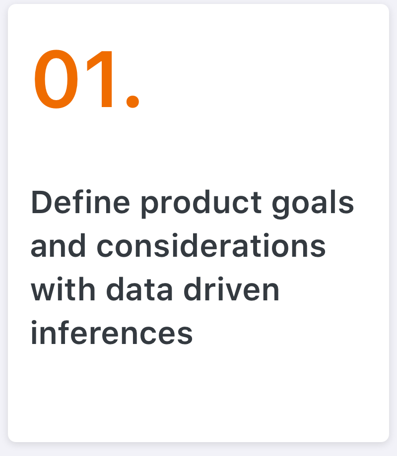

          

                
Requirement

          

The very capable and talented engineering team at Stuworx had taken the core idea about the platform, ample inspiration from similar services around the web, and the most prominent and popular Design Language around - Material Design, and come up with a UI that didn’t necessarily address the requirements at hand, and wasn’t too aesthetically appealing either. The founders worried this wouldn’t go far in making a serious first impression with the target demographic; and even if it did, the students wouldn’t come back. 

I was asked to help the team redesign the overall product design and user-experience while still utilising Material Design principles, considering the team had, and continues to use, [Angular Material](https://material.angularjs.org/latest/) as their frontend-framework of choice. 

It was also important for me to enable the development team with a scalable design framework that would allow them to test and add new features going forward, by themselves.

          

                
Approach

          

Aware that the effort wouldn't just be towards the comprehesive redesign, but also the heavy introspection from the team on their own decisions thus far, I opted for a sliglty different approach. I wanted the team to collectively brainstorm and come up with solutions themselves, with whatever guidance I could give. This would enable an honest review of thier own work but also give them greater assurance of the decisions being made for the way forward.

	

	

 

 

Workshops

It was necessary for the whole team to come together and contemplate on the user-experience requirements at hand, along with data from the user-surveys conducted, to establish a visual structure that would also take the aspirations of the organisation into account. This would later help us in defining branding and content strategies, as well.

          

                
Branding

          

  
Palette

		
	

  
Logo

		
	
	

          

                
Mockups

          

  
Homepage 

          

            

          

Course Details 

          

            

          

Course and Assessments 

          

            

          

Profile

<b>Note:</b> The mockups contain placeholder data and the number of screens is not exhaustive

Stuworx is currently is being used by students from 2 colleges as part of the beta program. Please visit the <a href="https://www.stuworx.com" target="_blank">Official Site</a> to check it out.

  

