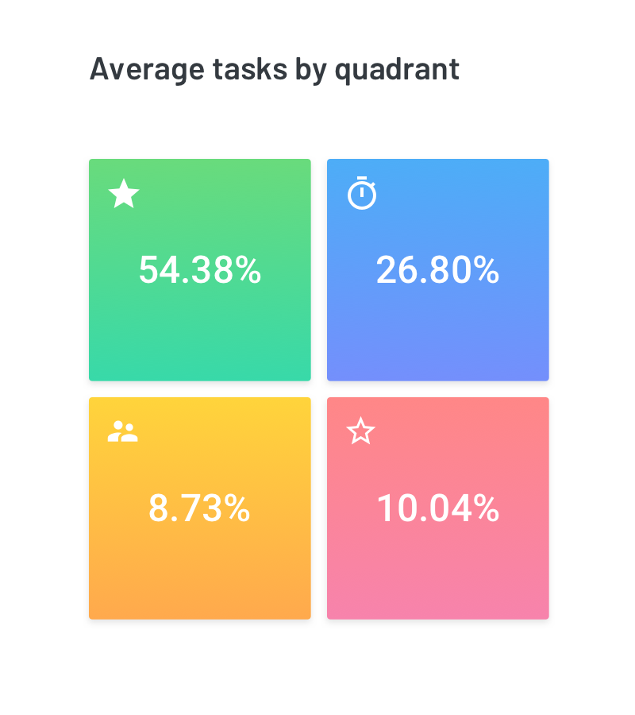
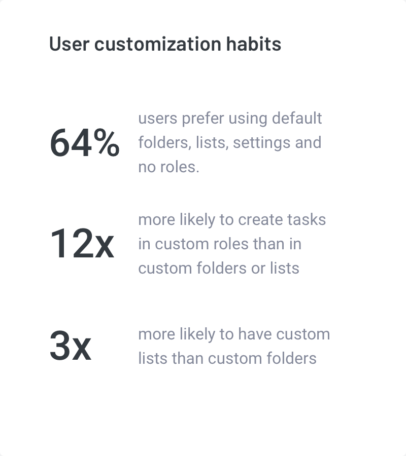

          

                
Challenge

          

Taskpad is a to-do app based on the [Eisenhower Matrix](http://www.eisenhower.me)

While the app enjoys a good rating, its interface leaves a lot to be desired. The app developers wanted me to take a look at the Product Design and suggest effective changes that could make the user-experience more effective, while retaining the utility of the app. I also had the opportunity to help devise the revenue model for the product.

          

          

                
Analysis

          

The app's design was straightforward and employed no bold strategies. However, since the app had already been on the Play Store for a while, I requested the developers to share some analytics data on user behaviour and obtained the following results.

          

                

          

The data seemed to suggest that while the app had not necessarily found its niche within the target demographic, select users did enjoy certain aspects of the app like role based tasks. 

However, from a user-experience perspective, a lot was still left to be desired, starting from the utility and understanding of the quadrants - we changed that bit up in accordance with more modern versions of the matrix. Additionally, 

* There wasn't a clear on-boarding process
* There was too much complexity with task hierarchies
* Information Density wasn't factored for on most screens
* The utility and importance of roles was barely highlighted

With this information in tow, I started conducting brainstorming sessions with the developers to come up with better process flows and more efficient UX practices that emphasized the unique offerings of the vis-à-vis competition.

I also started working with the founders to identify revenue models that took into consideration the nature of the product, key competencies, prevalent usage, and the management's key aspirations.

          

                
Design

          

We identified the key areas to address and chose to do so with some added tools, resources and frameworks from around the web. 

We took a modular approach to the re-design and identified key areas to address that would also leave us with scalable and re-usable elements.

	

          

                
Mockups

          

The current design of the app can be viewed on the Play Store [here](https://play.google.com/store/apps/details?id=com.pv.lite.taskpad&hl=en).

          

                
Re-design

          

Default Views

The newer, more aesthetic Card View and Expanded View have more information packed in the same space and utilise iconography to simplify the interface.

          

                

          

Creation of Tasks

The newer method of creating tasks makes the user-experience smoother by using background drawers instead of interrupting dialogs, giving visual confirmations, and relegating infrequently used features to the expanded view. 

      		

                

          

Detailed View/Edit

User Profile

<b>Note:</b> The mockups contain placeholder data and the number of screens is not exhaustive

The Taskpad engineering team is working towards incorporating the changes and the beta, along with a web version are expected to be launched by mid 2018

	

