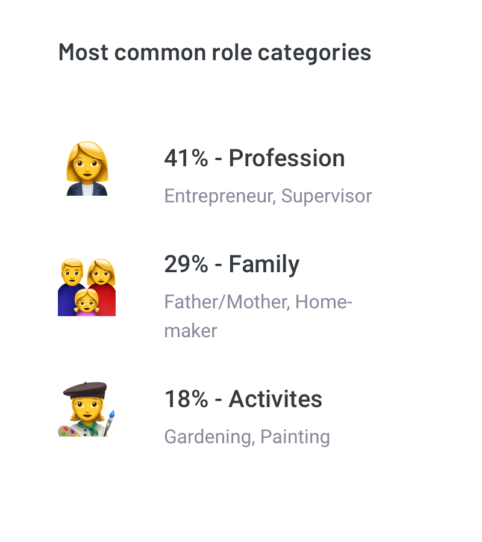
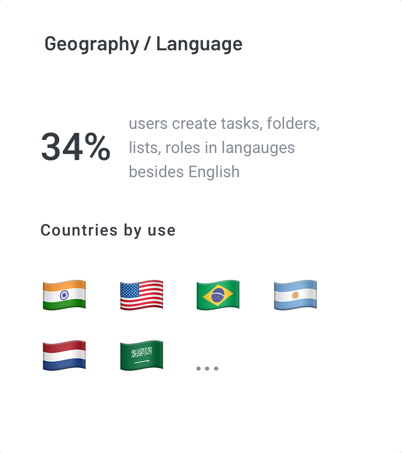

  

    

  
<a href="https://play.google.com/store/apps/details?id=com.pv.lite.taskpad&hl=en" rel="noopener" target="_blank">Taskpad</a> is a to-do app based on the <a href="http://www.eisenhower.me" rel="noopener" target="_blank">Eisenhower Matrix</a>. The founders wanted a redesign of the app that was now growing in popularity.

    

  
I was asked to consult on a new product strategy for Taskpad and redesign the user-experience and interface, accordingly

<h3 class="f3">Product Analysis</h3>

Despite the uninspiring design, the app enjoyed a healthy rating on the Play Store. So, I requested the developers to share some analytics data on user behaviour and obtained the following results.

<h3 class="f3">Inferences</h3>

The data seemed to suggest that while the app had not necessarily found its niche within the target demographic, select users did enjoy certain aspects of the app like role based tasks. 

However, from a user-experience perspective, a lot was still left to be desired, starting from the utility and understanding of the quadrants, on-boarding, information density, task hierarchies etc.

And so, we started our sprints on features, designs, revenue models etc. 

  

<h3 class="f3">Branding Process</h3>

We identified the primary areas to address and chose to do so with some added tools, resources and frameworks from around the web. 

We also took a modular approach to the re-design and identified key areas to address that would also leave us with re-usable elements.

<h3 class="f3">Better Homescreen</h3>

The newer, more aesthetic Card View and Expanded View have more information packed in the same space and utilise iconography to simplify the interface.

<h3 class="f3">Creation of Tasks</h3>

The newer method of creating tasks makes the user-experience smoother by using background drawers instead of interrupting dialogs, giving visual confirmations, and relegating infrequently used features to the expanded view.

<h3 class="f3">Reusable Components</h3>

Reusable components can be viewed everywhere from the new Detailed Create Task screen to the User Profile

Note — The mockups contain placeholder data and the number of screens is not exhaustive

The Taskpad engineering team is working towards incorporating the changes and the beta, along with a web version are expected to be launched by mid 2018. The <a href="https://play.google.com/store/apps/details?id=com.pv.lite.taskpad&hl=en" rel="noopener" target="_blank">current version</a> available on the Play Store does not have the changes reflected.

	

